# ConnectedLines
Processing sketch

## Starting point is this sketch I made yesterday
```java
void setup() {
  size(800, 800);
  background(random(255), random(100), 100);
  int times = 1000;
  float x = width/2;
  float y = height/2;
  while (times > 0) {
    float nx = x + random(-180, 180);
    float ny = y + random(-180, 180);
    color randomColor = color(random(255), random(100), 100);
    stroke(randomColor);
    strokeWeight(20);
    line(x, y, nx, ny);

    for (int i = 0; i < 5; i++) {
      float s = random(20, 50);
      randomColor = color(random(255), random(100), 100);
      stroke(randomColor);
      strokeWeight(random(5, 30));
      line(x+random(-s, s), y+random(-s, s), nx+random(-s, s), ny+random(-s, s));
    }
    x = nx;
    y = ny;
    times--;
  }
  save(System.currentTimeMillis()+"cchains.jpg");
}
```

## Sample output from the first run


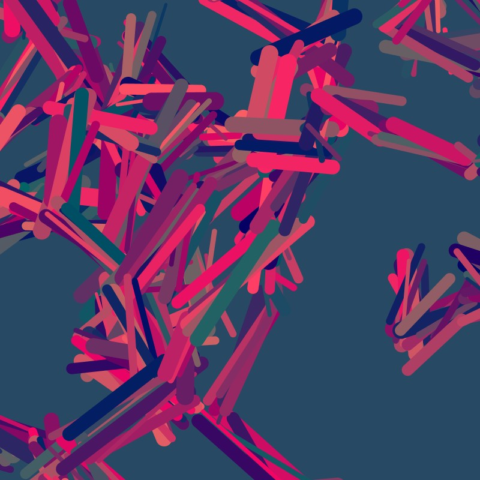
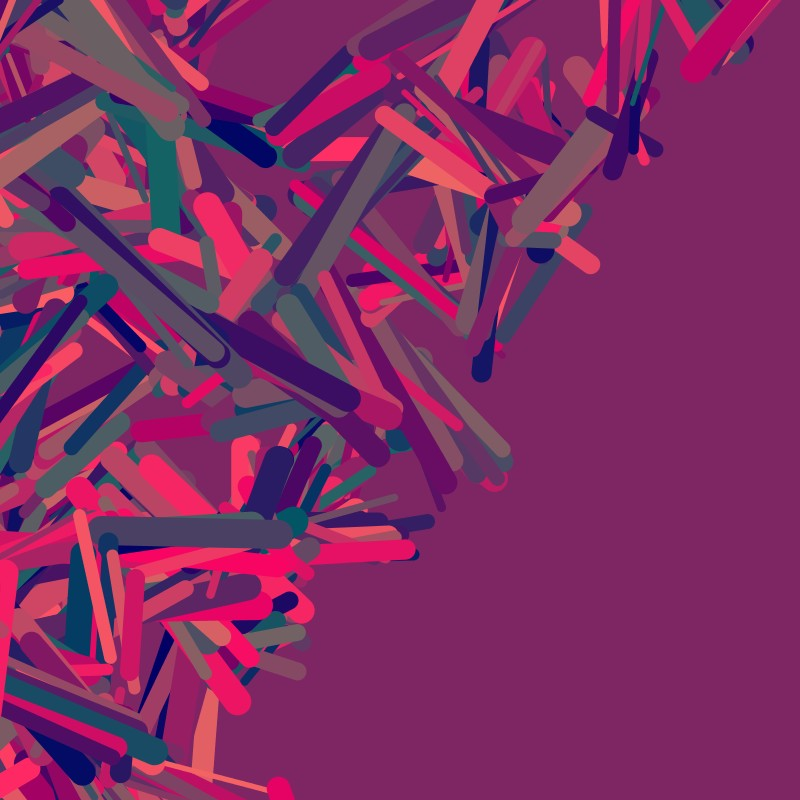
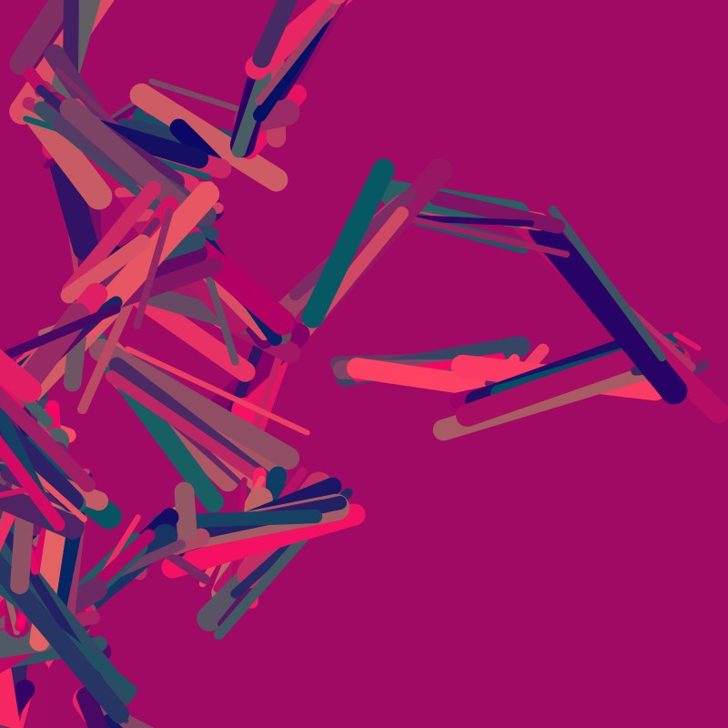
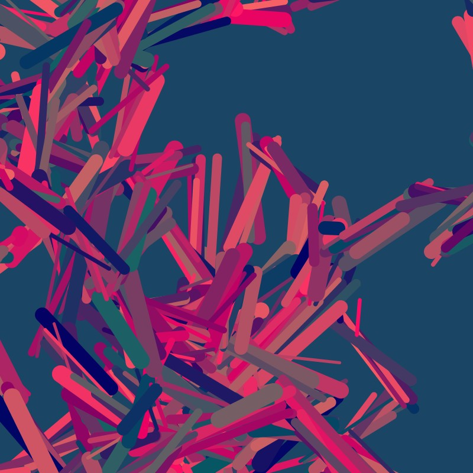
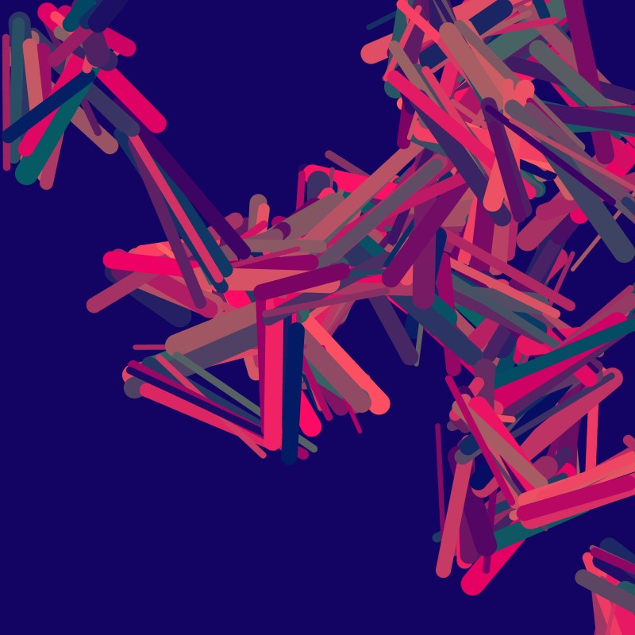
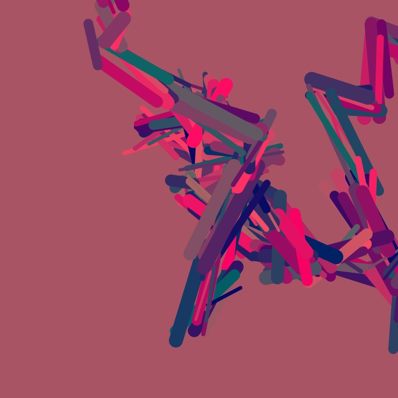

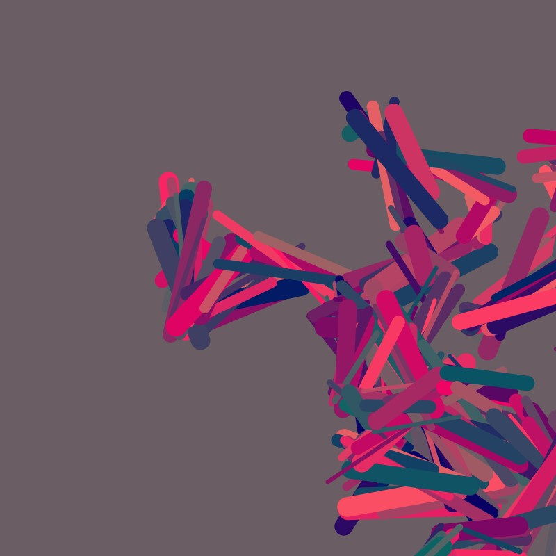


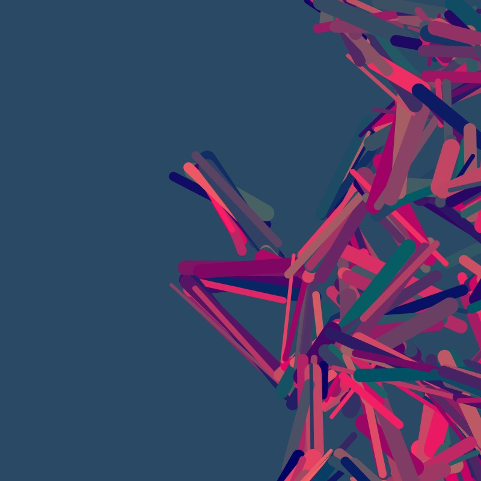
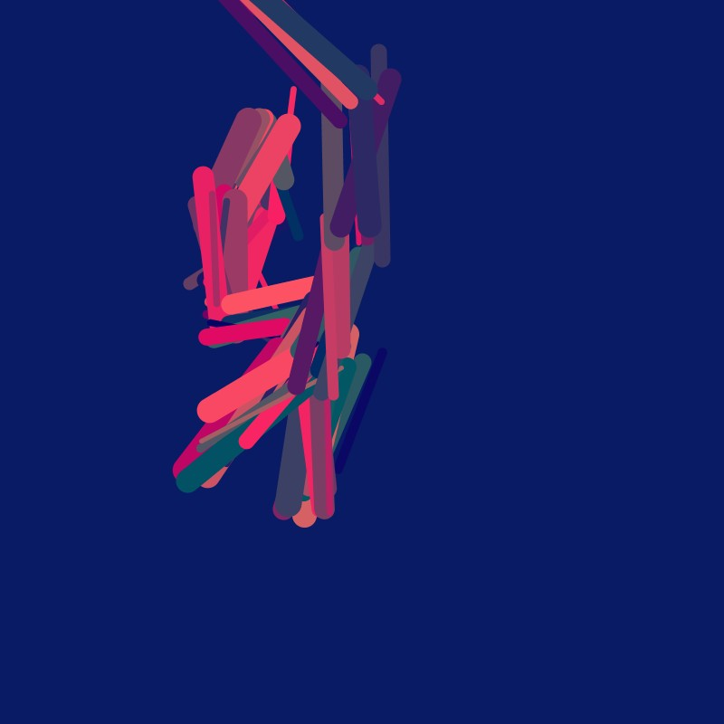
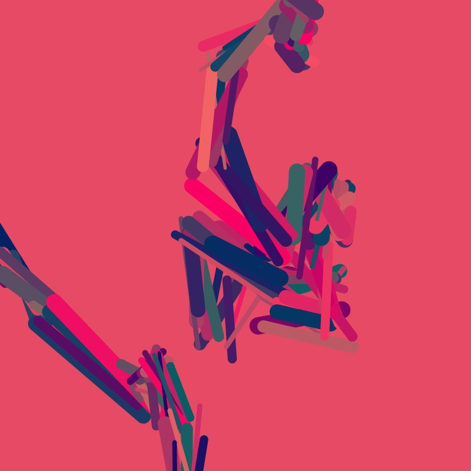
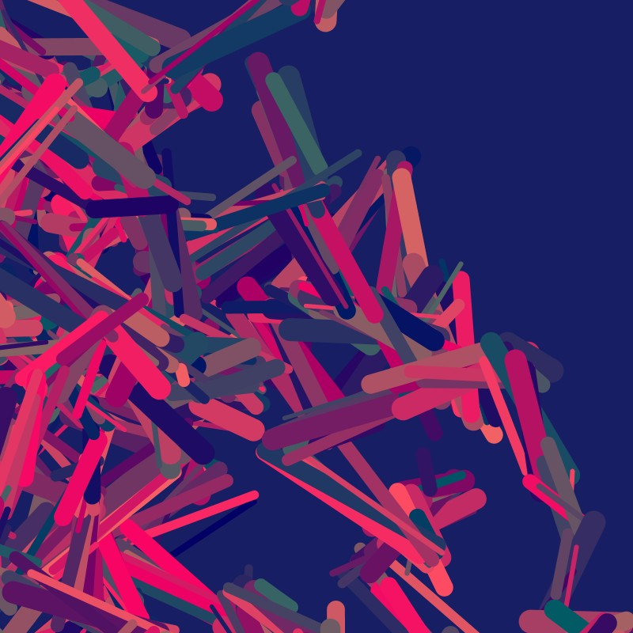
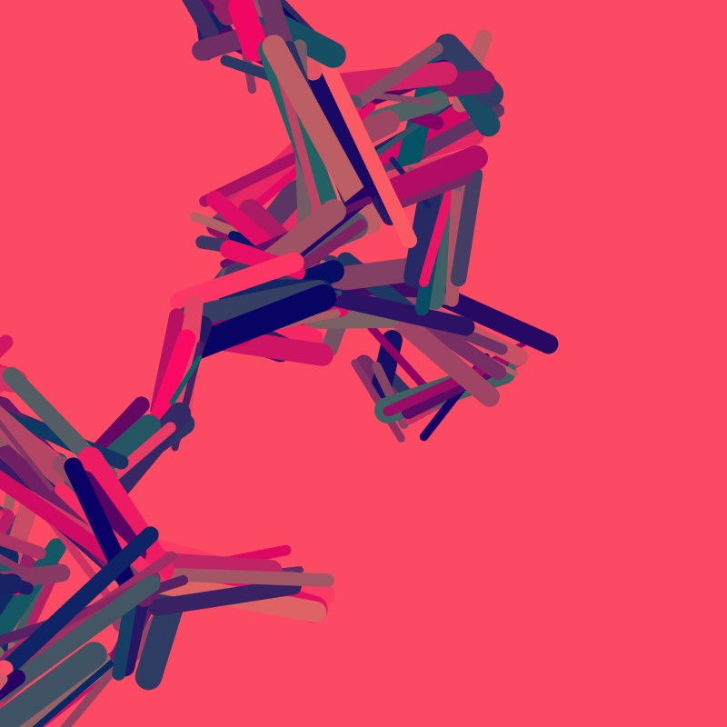
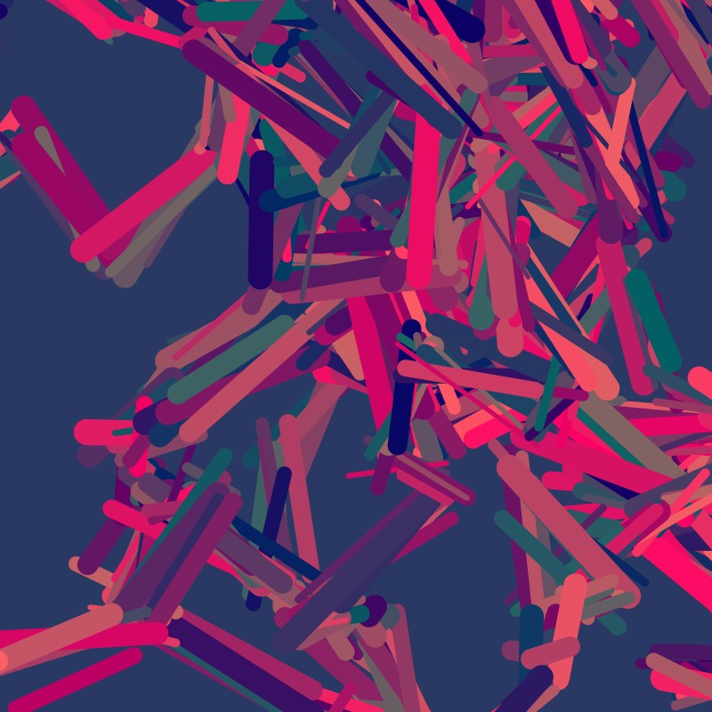


